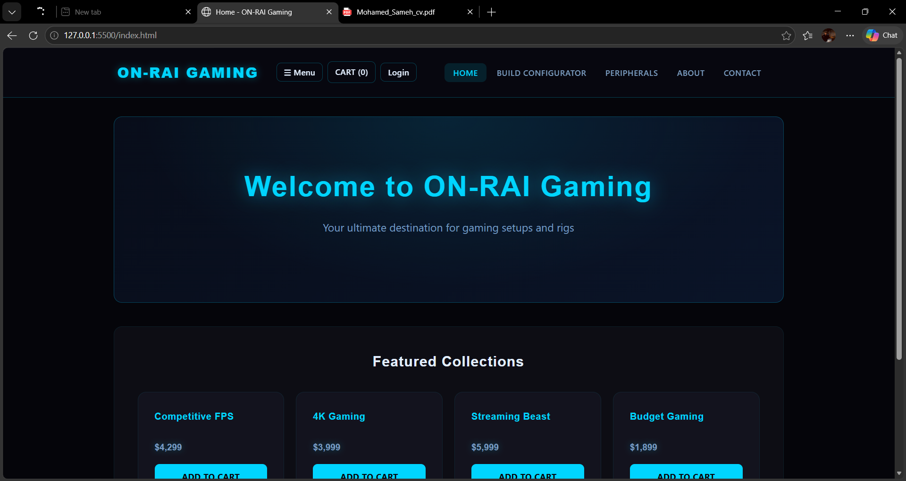

# 🎮 ON-RAI (Thunder Demon) - E-Commerce Website

A sleek, modern, and minimalist e-commerce web platform designed for premium gaming gear, PC setups, and tech accessories.

🔗 **Live Demo:** [View Website](https://mohamedelzpawy.github.io/ONRAI-Simple-Project)

---

## ✨ Features

- **Minimalist UI/UX:** Clean aesthetics with a "less is more" approach
- **Multi-Page Layout:** Fully structured multi-page navigation
- **Responsive Design:** Optimized for modern PC setups and desktop viewing

## 🛠️ Technologies Used


## 🚀 How to Run Locally

```bash
git clone https://github.com/MohamedEl3zpawy/ONRAI-Simple-Project.git
cd ONRAI-Simple-Project
open index.html
```

## 👨‍💻 Developer

**Mohamed Sameh** — Computer Science Student @ AAST  
[](https://github.com/MohamedEl3zpawy)

